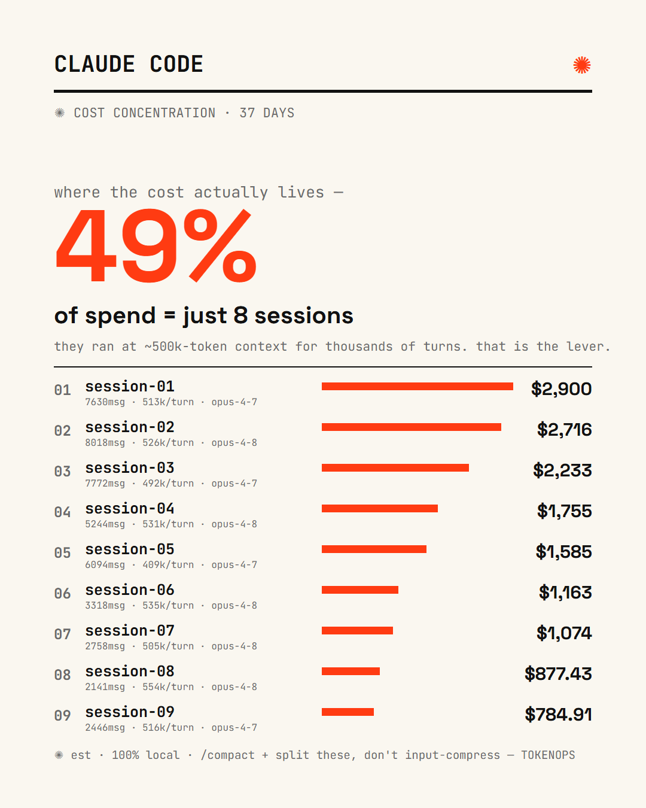

# tokenops

[](https://www.npmjs.com/package/@greymoth/tokenops) · MIT · 100% local



Claude Code の**実トークンコストを監査し、データで検証した最適化アクションを出す**ローカルツール。`~/.claude/projects` の JSONL を読むだけで、外部送信はゼロ。金額は推定API換算（Max/Pro 購読なら実支払いでなく「抽出した価値」）。

cc-usage の engine/フォントを再利用（隣の `Desktop/cc-usage/`）。

## なぜ作ったか — 計測したら通説が崩れた

37日・185k メッセージを成分分解した結果：

| 成分 | 比率 |
|---|---|
| cacheRead | **72%** |
| cacheWrite | 18.6% |
| output | 9% |
| **input** | **0.3%** |

opus がコストの **91.6%**。コストは少数の巨大 session に偏在（上位8本で約半分・毎ターン約50万トークンを再読）。

つまり世間で語られる **「input を圧縮して節約」はこのプロファイルでは無意味**（input は0.3%）。さらに静的プロンプトを圧縮すると prefix cache が崩れて**逆効果**。Antigravity 6本の網羅リサーチを self-kill して三角検証した結論：

- **却下/有害**（この使い方では）: input 圧縮（LLMLingua）/ semantic cache の出力キャッシュ（agentic で破綻）/ session 内の per-turn モデル切替（cache 全リセット）。
- **有効レバー**: ① cache 衛生 ② 境界（session/subagent 単位）モデル選択 ③ output 規律。

詳細＝`RESEARCH_SURVIVORS.md`、出典＝`../../GitRepo/REFERENCES.md`(2026-06-22節)。

## インストール（公開済み）

```bash
npm i -g @greymoth/tokenops
tokenops report      # グローバル CLI として（コマンド名は tokenops）
```

## 使い方

```bash
node bin/tokenops.mjs report     # 成分別コスト + モデル別（既定）
node bin/tokenops.mjs advise     # 優先順位付きの $換算アクション
node bin/tokenops.mjs waste      # session 別の無駄 + コスト集中
node bin/tokenops.mjs trend      # 週次コスト推移（実支出）
node bin/tokenops.mjs doctor     # always-on context(CLAUDE.md+memory)の重量→cacheRead換算（高速・scan不要）
node bin/tokenops.mjs card       # シェアカード3種 → _out/ (savings-card.svg + card-animated.html + waste-card.svg)
node bin/tokenops.mjs portfolio  # 全ストーリー1枚 → _out/portfolio.html
node _audit.mjs                  # 全機能の検証（ALL PASS）
```

`doctor` は #1 レバー(cache 衛生)を proactive 検査にした実機能。毎ターン cache 再読される CLAUDE.md＋各 project の MEMORY.md index の重さを測り、cacheRead コストへ換算して trim 対象を出す。**知識負債＝cache コスト**を1数字で示す。

`advise` の3レバー（コスト比で優先）:
1. **CACHE HYGIENE** — 巨大 session（≥300k ctx/turn）を milestone `/compact`・70%前に `/clear`・CLAUDE.md/tool を静的に保つ（動的値＝cache miss）。
2. **BOUNDARY ROUTING** — 機械的な session を丸ごと sonnet/haiku へ。**session 途中で切替えない**（prefix cache 全リセット＝純損）。
3. **OUTPUT DISCIPLINE** — 簡潔・構造化。

## 正直さ / プライバシー

- 送信ゼロ。ローカルの JSONL を読むだけ。
- 金額は engine の推定レート（cacheRead 0.1x・cacheWrite 1.25x/2x）。誇張しない。
- `card` の AFTER は**透明なレバー計算＋重複割引**の保守的推定で、捏造された「97% 削減」ではない。

## 構成

- `lib.mjs` — 1スキャンで per-session 集計＋成分コスト（cc-usage engine 再利用）。自己検査つき（`node lib.mjs`）。
- `advisor.mjs` / `observatory.mjs` / `savings-card.mjs` — それぞれ関数 export ＋単体 CLI。
- `bin/tokenops.mjs` — 1スキャンを全 subcommand に配る統合 CLI。

> `engine.mjs` とフォントは vendor 済（cc-usage 由来・greymoth 自身の資産）＝**自己完結**。cc-usage への相対 import なし。`npm pack` で publish 可能。
